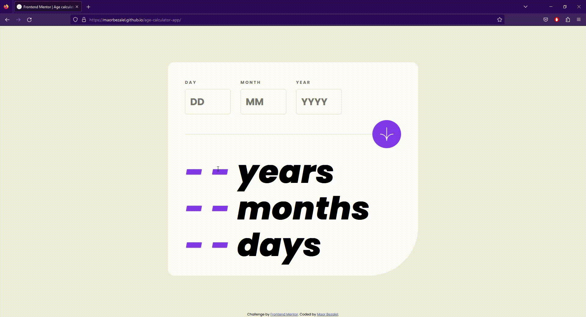

# Frontend Mentor - Age Calculator App Solution

This project, the "Age Calculator App", was created as a frontend practice exercise to enhance my skills in HTML, CSS, and JavaScript. 
The idea behind this project came from a challenge provided by Frontend Mentor, a platform that offers design challenges to improve frontend development skills. 
The main objective was to build a user-friendly app that allows users to calculate their exact age (in years, months, and days) by providing their birth date.

## Table of Contents

- [Overview](#overview)
    - [Preview](#preview)
    - [Links](#links)
    - [The Challenge](#the-challenge)
- [Process](#process)
    - [Description](#description)
    - [Key Features](#key-features)
    - [How to Use](#how-to-use)
- [Special Thanks To](#special-thanks-to)
- [License](#license)

## Overview

### Preview

### Links

- **Solution URL**: https://www.frontendmentor.io/solutions/html-css-javascript-NTbANz7TNM
- **Live Site URL**: https://maorbezalel.github.io/age-calculator-app/

### The Challenge

Users should be able to:

- View an age in years, months, and days after submitting a valid date through the form.
- Receive validation errors if:
  - Any field is empty when the form is submitted.
  - The day number is not between 1-31.
  - The month number is not between 1-12.
  - The year is in the future.
  - The date is invalid e.g. 31/04/1991 (there are 30 days in April).
- View the optimal layout for the interface depending on their device's screen size.
- See hover and focus states for all interactive elements on the page.

## Process

### Description

The "Age Calculator App" is a simple web application that helps users determine their current age based on their birth date. 
Users can input their birth day, month, and year into the corresponding input fields. 
After submitting the form, the app calculates the age and displays it in the "years," "months," and "days" sections.
 
**The project was developed using semantic HTML5 for the structure, CSS for styling and layout, and JavaScript for interactivity.**

### Key Features

- **Accurate Age Calculation**: The app allows users to calculate their age precisely in years, months, and days.
- **Input Validation**: The app ensures that birth date inputs are valid and within a reasonable range, allowing users to input only numbers (0-9) for day, month, and year.
- **Error Handling**: The app provides error messages for empty or invalid input fields, which are visually highlighted to guide the user.
- **Responsive Design**: The app is designed to work seamlessly across different devices and screen sizes.

### How to Use

1. Access the live site [here](https://maorbezalel.github.io/age-calculator-app/).
2. In the "DAY," "MONTH," and "YEAR" input fields, enter your birth date details.
3. Press the "Submit" button to calculate your age.
4. The app will display your age in the "years," "months," and "days" sections.

## Special Thanks To

- **Frontend Mentor**: For providing the challenge, alongside the necessary images, fonts, designs, and markdown guides. 
You can find their website [here](https://www.frontendmentor.io/). 

## License

This project is licensed under the MIT License - see the [LICENSE](LICENSE) file for details.
